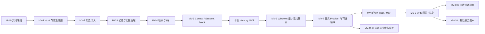

# Enouia Memory · 分阶段实施计划

版本：设计包 v1.0 / 2026-09-28。实现对象：Claude Opus 5.5。本文为完整规划，本轮没有执行任何实现阶段。

## 1. 实施纪律与版本关系

本计划采用 MV-* 编号，避免与 Runtime 已有 M0、A1/A2/A3、B1～B5 混淆。MV-0 对齐契约，MV-1/3/4 细化原 A1，MV-5 对应原 A2，MV-6 对应原 A3，MV-2 将原先后置的历史导入前移。Activity Track B 继续按其独立计划推进，不被 Memory 重排或偷偷扩展。

每个工作包完成后给出变更、证据、未实现项和下一步，再停在用户授权的阶段边界。用户可以明确授权连续多个阶段；未授权时不自动进入下一阶段。现有仓库的提交、co-author、测试约定照当时 AGENTS.md 执行；真实导入、Provider 外发、远端部署和生产切换不能由“代码已写完”自动触发。

先把设计同步进本仓库的文档和 ADR（v1.1：Memory 独立仓库，见 ADR-MEM-19），再添加代码。不能先写存储实现后以实现倒推 Schema。发现与本设计冲突时提供具体差异与影响，修正相应契约/验收后继续，不能仅留 TODO 绕过去。

v1.2（ADR-MEM-45）：凡改动 Runtime 集成面（`docs/integration/runtime-surface.json` 所列文件：workspace IPC 契约、嵌入式 Core、其构建闭包、参考外壳与前端，以及 2026-10-06 起 Runtime 安装程序所派生的参考安装程序），须在同一提交中重新生成该清单，并在 [Runtime 集成说明](../integration/RUNTIME.md) 的兼容记录中登记：改动内容、对 Runtime 属于新增还是破坏性变更，以及 Runtime 须采纳什么。登记前 `runtime_surface` 测试会一直失败。

## 2. 总依赖图与交付点

技术上独立的工作可以交错，但阶段门槛不能跳过。例如 API fake ports 可以先写，不能绕过本地恢复证明就导入真实历史。此图不是启动多个 Agent 的要求。

## 3. 阶段总表

| 阶段 | 完成后的可用能力 | 核心出口证据 | 对应验收 |
|---|---|---|---|
| MV-0 / MV-0R | 设计与现有 Runtime 契约无歧义；独立仓库与修正后的契约 | Schema/fixture/ADR 差异表，依赖边界，独立 Schema 交叉校验，隔离 checkout 构建 | D01～D04 的契约/静态部分 |
| MV-1 | 可安全存文件与恢复合成 Vault | 锁/提交/幂等/损坏/独立备份恢复 | V01～V09、D03/D04 行为部分、B01/B03/B04 |
| MV-2 | 历史先得到可核验保护 | 原件字节一致、分支/附件/重复导入报告 | I01～I07 |
| MV-3 | 人工批准的长期记忆 | 审核状态机、来源、冲突/替代/删除 | M01～M08、P01、B02 |
| MV-4 | 中文与项目检索 | 重建等价、权限过滤、短词与快照一致 | R01～R06 |
| MV-5 | 本地连续性闭环 | MoriMeta golden、预算、会话恢复、实际 capsule | C01～C08、S01～S04 |
| MV-6 | Windows 可日用审核与查看 | 全路径 UI/键盘/取消/错误恢复证据 | W01～W05 |
| MV-7 | 真模型基于共同记忆工作 | 两种 Provider 的真实受控 smoke 与外发记录 | P02～P06 |
| MV-8 | 其他 Agent 可受限接续 | 单 Host、多客户端锁、认证/范围/协议 | X01/X02/X04/X05；X03 先做合成认证契约 |
| MV-9 | 电脑关闭也能接收事件 | 接收先持久化、重投、ACK 丢失、队列恢复 | G01～G07、X03 实际 HTTP 认证 |
| MV-10 | 选定远程能力 | 密钥、撤回、删除、防回退、冲突和主机迁移 | N01～N06 |
| MV-11 | 可选检索质量和维护提升 | 与基线比较、外发与删除完整性不退化 | Q01～Q03 |

## 4. MV-0 — 契约冻结与仓库接轨

> **v1.1：** MV-0 草稿最初写在 Runtime 工作树中；经独立审核后由 MV-0R 迁入本仓库并修正 F1～F6（[报告](../validation/MV-0R.md)）。下文“迁入”“登记 ADR-MEM 编号映射”等步骤现以本仓库为目标。MV-1 从 MV-0R 已复验的独立工程开始。

前置：重读目标仓库 AGENTS.md、当前 HEAD/状态、Architecture v0.3 与后续 ADR；确认没有其他工作已实现了同一模块。

1. **MV-0.1 差异登记**：迁入适于公开的设计副本，去掉私人机器路径/实例；记录本计划替代旧里程碑中的哪些步骤。保留旧设计原件，不改写历史状态。登记 ADR-MEM 的仓库编号映射。
2. **MV-0.2 契约与 fixture**：将 DATA_MODEL 与 Context/IPC 字段转成机器 Schema，包含五类记忆、来源、候选、review、session、checkpoint、commit、tombstone、capsule。建立正例、反例和可重复 MoriMeta 合成库。
3. **MV-0.3 依赖与错误**：固定跨 crate 方向、Clock、随机 ID、文件/锁/秘密存储/Provider 端口；Memory 可复用 common，不依赖 Activity 或 Moriium。定义结构化错误和幂等行为。
4. **MV-0.4 测试计划**：明确 Windows 版本/文件系统、真实断电测试缺口、规模基准、需要未来用户选择的备份介质。把未确认资源列为阶段激活 gate，不阻塞合成契约开发。

交付：契约、合成 fixtures、ADR、边界测试与阶段报告。禁止：生产数据根、真实导入、UI、大模型调用、MCP、VPS。结束条件：D01～D04 的契约/静态部分通过，安装运行与存储隔离等尚需实现的行为部分明确交给 MV-1；这应当是交给 Claude 的第一个独立实现任务。

## 5. MV-1 — Vault 与恢复底座

> **v1.1：** MV-1 已在本仓库实现（合成数据、隔离目录），证据、测量与待办见 [MV-1 报告](../validation/MV-1.md)。restic 加密备份、OS 崩溃与断电证据仍为 pending。

1. **MV-1.1 存储安全**：实现数据根校验、NTFS ACL 检测/设置入口、reparse 防逃逸、配额预检、OS 单写者锁；秘密不经日志。
2. **MV-1.2 提交与恢复**：实现 immutable revisions、完整 catalog manifest、CURRENT 原子可见性、expected revisions、幂等 receipt、只读 pin；测试每个持久化边界。
3. **MV-1.3 最小会话/来源对象**：先支持确定性合成输入与 manual_assertion，所有关键字段落文件；实现健康状态和受限审计，不提前做智能抽取。
4. **MV-1.4 备份出口**：固定 commit 导出、restic 适配与独立位置恢复；验证恢复秘密不依赖原账户 DPAPI；重建出相同文件与引用。

交付：可在隔离本地目录运行的存储核心、恢复报告、失败注入矩阵。界面只需最小受控本地入口；不追求完整 Windows 外观。

结束条件：写入/响应丢失/双进程/磁盘满/破损 manifest 不导致已确认数据被覆盖；证明可恢复已确认事务的范围。没有断电证据时只称进程崩溃恢复，不升级可靠性宣传。

## 6. MV-2 — 历史导入与抢救

> **v1.1：** MV-2 已用合成导出实现（I01～I06 通过，I07 真实导出演练 pending），见 [MV-2 报告](../validation/MV-2.md)。4000 条来源的合成导入已越过 ADR-MEM-37 的清单阈值：导入大规模真实历史之前需要分段清单。

1. **MV-2.1 Import Framework**：preview、原件归档、manifest、可暂停批次、错误分类、重复文件检测。
2. **MV-2.2 三种输入**：ChatGPT 结构探测 adapter、Markdown byte-span adapter、Runtime native adapter；无样本的字段保守处理。
3. **MV-2.3 会话图与附件**：保留父子分支、修改版本、未知时间、缺失附件、部分导出；禁止默认外链下载。
4. **MV-2.4 覆盖报告与恢复**：导入后对象抽检、计数对账、重导入无增殖、备份/恢复来源定位。

交付：合成数据导入可重跑；经 Morii 选择真实输入并完成隐私/备份 gate 后，可做一次隔离真实迁移演练。没有用户提供的真实文件时不宣称平台兼容已证实，也不阻塞其余合成开发。

阶段结束时历史已安全接收，但尚未自动成为长期事实。真实 Raw 无损保护和语义迁移分别报告，不能用模型摘要覆盖原件。

## 7. MV-3 — Canonical、候选和治理

> **v1.1：** MV-3 已用合成数据实现，见 [MV-3 报告](../validation/MV-3.md)。先落地了分段清单与差分校验（ADR-MEM-39），再实现候选、计划绑定的主人审核、替代与冲突、Identity 修订、忘记与彻底删除、删除台账对账（ADR-MEM-40、41）。M01～M08、B02（逻辑删除）通过；P01 部分通过（capsule、索引、副本尚不存在，失去证据的记忆只列出未标记，原始包清洗替换未实现）。

1. **MV-3.1 五类记录**：验证类型字段、来源闭合、双时间、命题粒度、Identity 修订。
2. **MV-3.2 审核**：人工 propose/review/edit/reject/merge、trusted owner 确认、批次 expected revision、禁止 Agent 伪造批准。
3. **MV-3.3 变更与冲突**：supersedes 无环、范围替代、保留历史、冲突组、撤销错误审核（生成新审计记录）。
4. **MV-3.4 数据生命周期**：logical delete 立即屏障、purge 预览与传播、raw ZIP 内含数据处理、备份删除状态。未具备 purge 能力前不得把 UI 的删除标成“彻底删除”。

交付：文件可恢复的审核闭环和最小管理入口。禁止：自动接受模型提议、以 confidence 门槛代替用户批准、自动批量导入 Canonical。

## 8. MV-4 — Index 与 Retrieval

> **v1.1：** MV-4 已用合成数据实现，见 [MV-4 报告](../validation/MV-4.md)（ADR-MEM-42）。SQLite/FTS5 投影可删除重建，带提交水位与 known_at 区间；三字以上走 trigram，一两字走有界子串扫描；权限与删除在返回前过滤；排序 rank-1 由黄金集冻结。R01～R06 通过（R04 仅验证了允许/拒绝两种主体）。构建需要 MinGW C 编译器。

1. **MV-4.1 索引投影**：SQLite/FTS 与 record/project/source/time 关系，水位、取消、增量更新、全量重建。
2. **MV-4.2 中文检索**：实体别名、三字以上子串与一/双字 fallback；测试中英日混合和字面转义。
3. **MV-4.3 权限与历史**：过滤后召回、as_of/known_at、删除屏障、分页 cursor、防隐藏内容泄漏。
4. **MV-4.4 排序冻结**：确定性融合/排序、golden query 集、计时基线及质量报告。

交付：至少关键词、metadata、全文检索全部可用，索引删除后可得到同一授权集合。此阶段无 embedding、云搜索或默认 Raw 自动注入。

## 9. MV-5 — Context、Session 与 Mock 闭环

> **v1.1：** MV-5 已用合成数据实现，见 [MV-5 报告](../validation/MV-5.md)（ADR-MEM-43）。capsule、inspection、dispatch 作为 catalog 记录保存，Mock 只读已保存 capsule 并按 dispatch hash 复核实际请求；会话先存输入，checkpoint 为 provisional 并带覆盖 hash。C01～C08、S01～S04 通过；预算按 UTF-8 字节计，真实 tokenizer 与外发状态留给 MV-7。

1. **MV-5.1 Compiler**：当前性、来源、敏感/目的地过滤、版本化排序、budget 与溢出、解释原因。
2. **MV-5.2 Session**：用户输入先保存、流式中断语义、turn 状态、checkpoint 与覆盖、跨窗口/分支恢复。
3. **MV-5.3 Mock**：读取真实保存 capsule，返回确定性来源，不联网。保存实际检查记录，不隐藏另一套上下文。
4. **MV-5.4 MVP 验收**：MoriMeta 决策/实现区分、重启/重建等价、备份恢复、恶意来源注入、来源缺失时 abstain。

交付：本地 Memory MVP。可以在没有任何 Provider key、Windows 完整 UI、MCP 或 VPS 的机器验证。此时才能说明“长期连续性底座已可验证”。

## 10. MV-6 — Windows Memory Workspace

> **v1.1（2026-10-04 进度）：** MV-6 基线已用合成数据实现并合并，见 [MV-6 报告](../validation/MV-6.md)（ADR-MEM-44）。嵌入式 Core（`enouia-memory-workspace`）+ Tauri 2 外壳 + React 页面，经 workspace IPC v1 单一通道；文件只经原生对话框换令牌。[后续改进](../validation/MV-6-followup.md)补充安装、自启动、重试、无障碍，修复静默降级、卸载所有权、快捷搜索越权与界面旧响应/草稿丢失。合成数据上的真实应用回归 52/52、独立模拟界面检查 76/76、Rust 201 项及安装卸载 8/8 通过。测试专用 0.1.1 包验证了升级、降级拒绝及合成 Vault 保留；发行版本仍为 0.1.0，不代表旧数据格式迁移验收。实际登录启动、Narrator、系统对比主题、交互安装/旧发行版升级及签名仍待验收。MV-7 尚未开始。

> **v1.2（2026-10-04，ADR-MEM-45）：** 本阶段界面的宿主改为 Runtime：Runtime 的 Windows 客户端以固定修订嵌入 `enouia-memory-workspace`，成为产品客户端。现有 W01～W05 证据（W01～W04 通过，W05 部分通过）来自本仓库参考外壳 `apps/workspace`，须由 Runtime 在其宿主上重新验证；参考外壳继续作为本仓库的验收工具。本说明不开启新阶段。

> **2026-10-05～07 接入加固：** 补充了 Vault 生命周期状态隔离、Core 并发互斥、任务取消结果、原生退出/锁定后台调度、选择令牌并发占用、UTF-8 来源分页检查，remember 重放的 claimKey 绑定，并发手动来源重放的返回 ID 修复，Context 会话并发重放 ID 修复，Mock dispatch/reply 重放修复，以及修订/遗忘请求绑定，详见[文档索引](../README.md)中的十八份 ADR-MEM-46 后续报告（包括输入保存前开始的整条会话重放验收、晚发布提案回执恢复，不同键提案并发查重修复，从来源创建开始的整条 remember 重放和目标修订新鲜度验收，导入预览/后台导入的文件类型和读取边界加固，以及并发确认的完整结果重放修复和删除确认与锁定/关闭的组合路径验收）。本修订的完整 Rust 测试 271 项（Core 60 项）、fmt、Clippy、独立 34-schema 交叉检查及 Runtime 接入面检查通过；新增证据为本地合成数据。Runtime 尚需更新固定修订、适配行为并在自身 Windows 客户端重新验收；实际登录启动、无障碍、签名等原有待验收项不因此完成。仍处于 MV-6，MV-7 未开始。

1. **MV-6.1 薄 UI**：Memory Explorer、Import Center、Candidate Review、Sessions，typed IPC 与取消/分页。
2. **MV-6.2 Context Inspector**：区分 compile preview / 实际 dispatched、来源和排除理由，权限不泄漏。
3. **MV-6.3 Recovery / Status**：索引重建、备份恢复预览、删除影响、锁定、组件健康、工作线程与进度。
4. **MV-6.4 Companion Shell**：最小 tray/hotkey/overlay；与 Activity 页面通过已有接口汇合，不侵入其数据域。

交付：用户可独立完成“导入 → 审核 → 问题 → 查看依据 → 纠正 → 重启接续”。验证键盘访问、错误提示、热键冲突、长任务不阻塞 UI，以及 UI 崩溃后的数据保全。

## 11. MV-7 — 真实 Provider 与可选模型抽取

> **2026-10-10 功能进度：** 主人已明确开启 MV-7，并要求暂不进行真实 smoke。两家文本 API 的原生适配、外发审核/授权、持久化和限额已实现，见 [报告](../validation/MV-7.md) 与 [ADR-MEM-47](../adr/047-explicit-provider-dispatch.md)。workspace 页面仍使用 Mock；Runtime 宿主接入、账户能力与真实双 Provider 验收待做。可选模型抽取已实现来源片段绑定、候选审核队列、暂停/恢复、拒绝项抑制及预算，尚未在宿主激活；不宣称 MV-7 阶段验收完成。

1. **MV-7.1 接口探测**：核对所选 OpenAI/Anthropic/本地 Provider 官方版本和账户实际能力，固定 tokenizer/预算能力与密钥存储。
2. **MV-7.2 外发与调用**：确切 payload inspection、敏感内容确认、超时/取消/重试、禁止未授权 fallback、流式保存。
3. **MV-7.3 双 Provider 验收**：同一批准证据集生成可追溯回答；平台 A 失败时 Vault 仍正常；不要求模型行为逐字相同。
4. **MV-7.4 可选候选抽取**：按来源片段、预算、版本和可恢复任务处理；候选进入人工队列，拒绝项不反复刷屏。

交付：真实受控调用证据与用量/成本限额设置。没有 API 资源只能称适配器合成测试完成，不能称真实模型已经接通。模型抽取是可选能力，不把 API 调用作为本地存储条件。

## 12. MV-8 — Memory Host 与 MCP

1. **MV-8.1 进程转换**：从嵌入 Core 升级用户级唯一 Host，排他锁、迁移/升级协议、UI 断开与重连（UI 指 Runtime 的 Windows 客户端，沿用 workspace IPC v1 信封连接 Host；参考外壳承担重连验收）。
2. **MV-8.2 本地工具**：stdio MCP adapter、principal/scopes、六个最小工具、旧 memory_update 仅提议别名。
3. **MV-8.3 客户端接入**：按实际产品逐个测试 transport、auth、工具大小/许可；保存兼容矩阵。
4. **MV-8.4 安全验证**：无凭据、错 scope、恶意来源、伪造 review、重复写、旧 revision、锁定后重用会话均失败。

交付：本地跨客户端语义连续性；不会自动抓取第三方聊天全文。只有已测试产品和版本写入“支持列表”。

## 13. MV-9 — VPS Gateway、Queue 与可选远端备份

1. **MV-9.1 配置与隔离**：域名/TLS、认证、服务账户、独立目录、最小日志、配额、队列备份；不改 Moriium 服务。
2. **MV-9.2 接收持久化**：event envelope、签名、重放、原子引用、durable_received、满盘拒收。
3. **MV-9.3 本地拉取/ACK**：outbox/inbox、lease、幂等、连续游标、dead letter、删除优先级；先本地 commit 再确认。
4. **MV-9.4 故障与重建**：电脑关机、VPS 重启、ACK 丢失、服务丢失、长时间离线、凭据轮换与重建。可选 G2 密文备份单独测试恢复秘密不在 VPS。

交付：电脑关机仍能可靠地接收已获准事件；Memory 读取需要本机在线时快速反馈 offline。部署前需要实际 VPS、域名/TLS、备份目标与限定 connector；本设计不假设这些资源已经具备。

阶段成本先根据负载测量：事件量、附件大小、保留期、并发与带宽。小型单用户服务先单实例；达到瓶颈才评估 PostgreSQL/对象存储拆分，不给无依据的固定服务器采购建议。

## 14. MV-10 — 两条独立远程路线

**MV-10a 加密设备副本**：设备注册/撤回 → 密钥交付与恢复 → 允许子集加密同步 → 终端解密索引/编译 → 离线候选 → 主设备审核 → 删除与失窃演练。先明确手机/PWA 安全存储和浏览器数据被清除时的恢复能力，再决定具体客户端。

**MV-10b 服务端可计算子集**：逐范围授权 → 明确服务端可见明文的信任变更 → TTL/版本/策略校验 → 同版本 Compiler → 只读上下文与候选回传 → 撤回/到期/删除测试。默认不包含 Raw、附件、关系/健康/财务或 highly_sensitive。

两者都不开放双主 Canonical 写入。完成一条不要求完成另一条，也不能把 G4 宣传成 VPS 无法解密的 E2EE。如用户确需完整私人历史随时可读，单独评估更大信任与密钥/终端风险，而不是偷偷扩大默认子集。

## 15. MV-11 — 有证据再增加的能力

- 本地 embeddings：只有 FTS golden 显示实际漏召回且资源可承担时再做；记录质量、延迟、磁盘与删除效果。
- 智能整理：允许建议去重、过期复核、候选合并；不允许自动改身份或绕过 audit。
- 附件 OCR/语音转录：单独授权和来源定位，不因加入模型就扩大原件外发。
- 存储优化：增量目录、GC、压缩、审计 checkpoint；必须保留提交/恢复语义和独立备份。

交付标准是较基线有可测量收益且不降低隐私、恢复和来源完整性；不是功能越多越好。

## 16. 阶段报告模板

每次阶段报告包含：阶段/工作包、起始与结束 commit、实际改动、完成能力、执行过的测试与样本规模、合成/真实证据区分、失败与局限、恢复/回退点、未激活的外部能力、下一阶段需要的输入。无资源的验证列 pending，不记作通过。

本轮不提供虚假的日历承诺。MV-0 完成后由实现者根据环境、导出规模和 MV-1 的存储原型给出工期区间；最优先资源始终是原始导出与独立恢复位置，而不是先采购 VPS。
