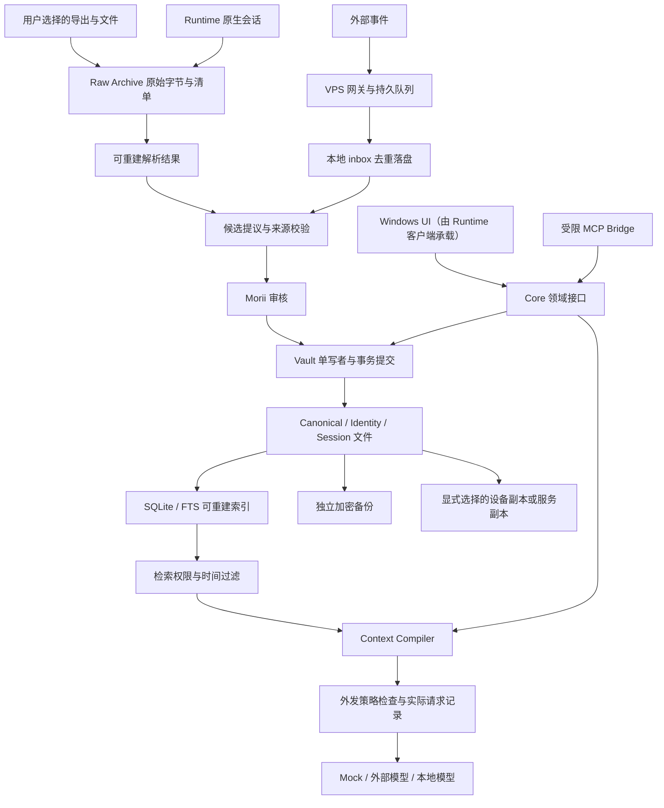

# Enouia Memory · 总体架构

版本：设计包 v1.0 / 2026-09-28。本文负责组件、存储权威和事务；字段以 [DATA_MODEL](DATA_MODEL.md) 为准，安全策略以 [PRIVACY_RECOVERY](PRIVACY_RECOVERY.md) 为准。

## 1. 与既有 Runtime 的关系

本设计扩展 Runtime v0.3 的 Memory / Context / Session 域，并把历史保护提前。保留 Rust 领域层、Tauri 2 + React/TypeScript/Vite 的 Windows 方向、Mock 优先和 Activity 独立原则。它没有授权改动 ActivityData v1、Activity 序列/锁、Moriium 服务或生产调度。

2026-09-28 只读检查时，Runtime Cargo workspace 包含 common、activity-contract、activity、windows-process、activity-store、activity-delivery；未列出 memory、context、session、provider 或 Windows app。README 报告了 Activity 多项原语进展；本轮没有重新运行这些测试，不把它们当作 Memory 已存在的证据。

对既有设计的新增/收紧列在 [决策表](DECISIONS_AND_SOURCES.md)：历史导入提前、人工批准边界、事务级提交、加密备份门槛、后续常驻进程。

**v1.1 更正（MV-0R）：** Memory 在独立仓库实现，拥有自己的契约、领域代码与最小宿主端口；Runtime 只通过版本化契约或固定版本发布物接入，并以自身适配器映射健康状态与错误（[ADR-MEM-19](../adr/README.md)）。Runtime 的已生效契约不被本仓库改写；差异记录在本仓库 ADR 与 [契约说明](../contracts/CONTRACT_NOTES.md)。

**v1.2 修订（2026-10-04，ADR-MEM-45）：** Runtime 的 Windows 客户端是 Memory 本地部分的产品客户端：它以固定 Git 修订嵌入 `enouia-memory-workspace`，只经 workspace IPC v1 和自身适配器调用，不直接调用领域 crate；本仓库 `apps/workspace` 是参考外壳与验收工具。每个宿主按原生窗口身份套用 `HostSurface` 限定调用范围，同一 Vault 同时只运行一个嵌入式 Core，只打开显式选择的数据根。集成面的改动先在 [Runtime 集成说明](../integration/RUNTIME.md) 登记，再由 Runtime 升级固定修订。Provider、Host/MCP、网关与副本等云端部分仍在本仓库实现。

## 2. 系统全图



Activity 没有进入这条数据链。Windows 可以在独立 Activity 页面显示它自己的状态，但 Memory 不读 Activity 数据库、CLI 使用日志、上传待发队列或公开 JSON 来自动形成记忆。

## 3. 组件与责任

| 组件 | 唯一职责 | 禁止跨越的边界 |
|---|---|---|
| VaultStore | 校验、单写者、事务、快照、恢复、来源及记忆文件读写 | 不直接调用模型或上传 |
| Importer | 保存原始字节；解析来源、分支、附件；输出覆盖报告 | 不自动创建正式记忆 |
| CandidateService | 提议、去重提示、冲突检测、审核提交 | 模型不能伪造用户批准 |
| SessionService | 追加会话事件、完成状态、分支与临时 checkpoint | 不把会话摘要当来源全文 |
| IdentityService | 装载已批准身份、风格、关系配置 | 内容不能更改 ACL、外发权限或工具授权 |
| IndexService | 生成 SQLite/FTS 元数据和检索投影 | 索引缺失不能丢失审核/删除记录 |
| ContextCompiler | 检索、时效判定、排序、预算、来源打包 | 不拥有凭据，不隐藏额外记忆 |
| PolicyService | 读取/目的/外发/副本权限，当前删除屏障 | 不接受模型给自己的权限升级 |
| ProviderAdapter | 能力、请求渲染、调用、取消、错误和用量 | 不写 Canonical，不接收整个 Vault |
| Windows（Runtime 客户端；`apps/workspace` 为参考外壳）/ CLI / MCP | 领域接口适配与呈现 | 不另造数据库或绕过 Core 写文件；Windows 宿主只经 workspace IPC v1 调用 Core |
| Gateway / Sync | 接收、持久暂存、租约、去重、游标、回执 | 不做权威记忆合并，不替本地批准 |
| BackupService | 固定提交点导出、加密备份、检查与恢复演练 | 备份成功不等于恢复已验证 |

逻辑组件不等于立即拆出同名 crate。v1.1：全部在本仓库实现，先有纯契约 crate `enouia-memory-contract`，其后按阶段需要增加 memory（存储/审核/索引）、context（检索与编译）、session（会话）、provider（适配器）等 crate（现有 crate 与依赖方向见 [契约说明](../contracts/CONTRACT_NOTES.md) §4）；v1.2：组合它们的是本仓库的嵌入式 Core `enouia-memory-workspace`（ADR-MEM-44）；Windows 产品客户端由 Runtime 以固定修订嵌入该 Core（ADR-MEM-45），本仓库 `apps/workspace` 为参考外壳。避免为尚未实现的远程功能搭建空框架。

## 4. 谁是权威源

| 数据 | 权威形态 | 可重建性 |
|---|---|---|
| 原始导出、附件字节 | 不可变对象 + import/source 清单 | 丢失后无法由摘要重建 |
| Canonical 与 Identity | CURRENT 选中的修订文件 + 审核来源 | 可从有效历史提交恢复，不能从 Raw 自动还原相同人工判断 |
| 候选与审核 | 候选修订、review 记录、提交清单 | 不依赖数据库恢复 |
| 会话、checkpoint、请求收据 | 文件事件与对象，关联到提交点 | 不由聊天平台缓存替代 |
| 删除与访问策略 | 版本化策略、tombstone 和 purge 回执 | 备份必须包含；不能遗漏后复活旧资料 |
| SQLite/FTS、embedding | 带版本和提交水位的索引 | 从允许的文件集合重建 |
| UI 缓存、类别 Markdown 汇总 | 派生呈现 | 随时重新生成 |
| VPS 尚未本地确认的队列 | VPS 独立持久队列及其备份 | 尚未接收本地前无法由本地 Vault 重建 |

Raw 只证明“来源中有这段内容”；Canonical 表示“Morii 以此范围和时间接受这条陈述”。二者不相互替代。哈希证明字节一致，不证明陈述真实，也不证明来源来自某个真人。

## 5. 数据根与可读格式

运行数据默认在 `%LOCALAPPDATA%\EnouiaMemory`（v1.1；与 Runtime/Activity 的数据根分开）；允许显式更换经过验证的本地绝对路径。不使用本仓库、其他源代码库、安装目录、网络共享或 OneDrive 同步目录作为运行 Vault。v1.2：CLI 与各 Windows 宿主（参考外壳、Runtime 客户端）都只打开显式选择的根，不使用上述默认位置（ADR-MEM-37、44、45）。

以下为目标布局，仅是路径规范，没有在本轮创建这些目录：

```text
EnouiaMemory/
  vault/
    vault.json                         稳定 vault_id、格式、设备与版本说明
    CURRENT                            指向一个完整提交清单
    commits/<commit_id>.json            父提交、修订目录、对象哈希与事务操作
    records/memory/<id>/<revision>.json
    records/identity/<id>/<revision>.md
    records/source/<id>/<revision>.json
    records/candidate/<id>/<revision>.json
    records/review/<id>.json
    records/session/<id>/<revision>.json
    records/checkpoint/<id>/<revision>.json
    records/policy/<id>/<revision>.json
    records/approval/<id>.json            外发/降级/授权批准（v1.1）
    records/tombstone/<id>.json
    records/receipt/<id>.json
    raw/objects/<sha256>                收到的原始字节，含完整导出包
    raw/manifests/<import_id>/<revision>.json
    session-events/<session_id>/<event_id>.json
    assets/objects/<sha256>             实际收到的附件，不凭链接假定已收到
    staging/<transaction_id>/           未提交内容；不进入检索
    audit/<segment_id>.jsonl            受限、可轮转的访问审计
    exports/                           显式生成的可读汇总；非权威
  indexes/memory.sqlite                 可删除并重建
  config/                              非秘密配置
  backup-state/                        备份回执与恢复演练信息
  sync-state/                          后续阶段的持久同步状态
（Activity 数据属于 Runtime 自己的数据根，不在此布局内，Vault 操作从不触碰。）
```

每个 memory ID 每次修订一个 JSON，格式 UTF-8、稳定键顺序、两空格缩进、LF；哈希以实际保存字节为准。Markdown Identity 也具有 sidecar 元数据修订并由同一提交引用。不得依赖操作系统文件 mtime 判断业务时序。

规范化数据时间输出 UTC ISO-8601，原始时间字符串、原始时区和未知值保留在来源中。Windows 文件名只使用系统生成的安全 ID/哈希，不使用标题、用户名或导入路径。

用户修改导出的 Markdown 可以通过“导入编辑稿 → diff → 审核”回到系统。直接修改 records 下的文件导致哈希不匹配，进入隔离/修复；不得静默认为是新事实。这使可读、可 diff 与完整性检查同时成立。

## 6. 单写者与事务协议

一个 Vault 只允许一个写者进程。CLI、UI、未来 MCP 都经同一领域接口；每次写入持有 OS 级排他锁，并校验 expected_commit_id。内存 mutex 不足以防两个进程竞争。

首次初始化是独立的 genesis 操作：本机交互用户在可信入口确认新建空 Vault，生成 vault_id、owner/device 身份、默认拒绝外发策略和初始 commit；没有 CURRENT 的既存非空目录不得自动重新初始化。genesis 不从导入正文推断 owner，不预装未经批准的私人身份资料。以后创建 Identity 同样走审核。

一次“接受候选并替代旧事实”可能同时修改候选、旧记忆、新记忆、review 与策略。必须作为一个事务：

1. 取得锁，固定基准 CURRENT，检查请求身份、权限、幂等键及 expected revision。
2. 在同卷 staging 写所有新修订及必须的来源对象；验证来源可解、状态和 supersession 图合法。
3. 将不可变对象写到最终位置并 flush；写完整 commit 清单，包含父提交、对象哈希、逻辑记录到修订的完整映射、审核证明及 operation receipt，再 flush。
4. 仅当全部对象可验证，使用经 Windows 验证的同卷原子替换发布 CURRENT；读者始终 pin 一个 commit。跨卷复制不是提交原语。
5. 达到选定存储持久化等级后才回复 committed。返回 commit_id、revision、operation_id；若响应丢失，重试从文件收据返回同一结果。
6. 释放写锁，异步推进索引水位。索引失败显示 index_lag，不撤销已提交记忆，也不伪称整个写入失败诱发重复。

初版清单是完整目录映射，历史对象只引用不整库复制。这是偏向可靠性的选择，会随记录数增加产生清单写放大；MV-1 必须测量。增量树/分段清单属于后续优化，需保持单一提交语义。

CURRENT 损坏或目标不完整时禁止自行选择目录里“最新”的 commit，因为它可能从未发布。进入 Recovering，通过有效父链、已验证快照和恢复记录选择已知安全提交；无法证明时保持只读并报告需恢复。阶段内测试必须区分进程崩溃、操作系统崩溃和实际断电证据，不能把文件 rename 宣称成所有硬件上的断电保证。

## 7. 一致读取和索引

检索固定 `vault_commit_id`，只接受相同水位索引。落后时等待可取消的增量更新或在限定规模下直接读取允许记录；不得悄悄混用旧索引结果和新正文。大型库默认返回 index_not_ready，并给进度与仅来源浏览入口。

权限收紧、删除和退出登录还要在返回内容与发送 Provider 前检查当前 policy_epoch / deletion_epoch，即使该请求固定了旧快照也不能继续泄露已撤回内容。索引只负责找候选 ID，最终读取永远复核真实修订、权限和 tombstone。

SQLite 保持本地；不把运行中的 DB/WAL 放同步盘。SQLite 官方说明 WAL 依赖同机共享内存；这支持本设计的本地索引部署选择。[SQLite WAL](https://www.sqlite.org/wal.html)

## 8. 进程演进与离线行为

| 阶段 | 拓扑 | UI 关闭后 |
|---|---|---|
| MV-1～MV-5 | 库 + 最小本地控制入口 | 没有承诺常驻采集；已有数据安全保留 |
| MV-6～MV-7 | Runtime 客户端嵌入固定修订的 Core（`enouia-memory-workspace`），复用同一库；参考外壳 `apps/workspace` 也嵌入 Core，但不与 Runtime 同时打开同一 Vault | Core 可退出；Activity 仍按自己的进程约定运行 |
| MV-8 | 单一用户级 Memory Host + UI/CLI/MCP 适配器；Runtime UI 改为 Host 客户端，workspace IPC v1 信封不变，只换宿主传输 | Host 可独立运行；主机锁与生命周期已验证 |
| MV-9～MV-10 | 本地主机主动连 Gateway；可选设备/服务副本 | VPS 排队；读能力取决于明确授权的副本模式 |

MV-8 切换 Host 后 UI 不再内嵌第二个可写 Core。用户登出、休眠、关机或 Vault 锁定时本地服务不可用；不默认安装 SYSTEM 服务绕过账户边界。

完全断网时：已归档历史、已批准记忆、来源查看、FTS、人工审核、上下文编译与 Mock 可用；云模型和远程队列不可用。索引损坏不影响 Raw 和修订文件完整性。Provider 故障不得导致 Vault 失效。
